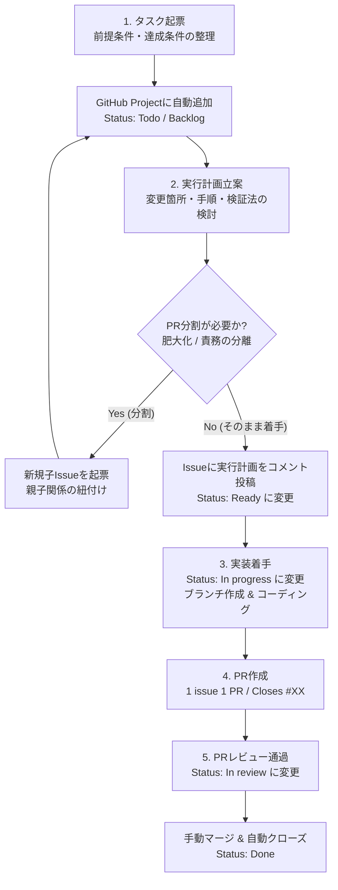

# プロジェクト管理・開発ワークフロー

本リポジトリ (`langgraph-statcast-agent`) におけるプロジェクト管理および開発標準ワークフローのガイドラインです。  
開発作業の透明性向上、レビュー負荷の軽減、再現性の高い品質担保を目的としています。

---

## 1. ワークフロー全体図

開発の流れは **「タスク起票」→「実行計画立案」→「実装」→「PR作成」→「レビュー」** を基本サイクルとします。



---

## 2. 各フェーズの詳細ルール

### フェーズ 1: タスク起票 (Task Creation)

* **管理場所**: GitHub Issue および GitHub Projects
* **粒度と方針**:
  * 起票段階では詳細な実装計画やコード設計に踏み込む必要はありません。
  * **「前提条件 (Prerequisites)」** と **「達成条件 (Definition of Done)」** が明確になっていれば起票完了として構いません。
* **テンプレート**:
  * `.github/ISSUE_TEMPLATE/task.yml` を使用して作成します。
* **必須記載事項**:
  1. **概要**: 何を目的としたタスクか
  2. **前提条件**: 着手・完了に必要な依存関係（他タスクの完了、環境、アカウント情報等）
  3. **達成条件**: 何が完了したらクローズできるかのチェックリスト
  4. **親Issue**: 分割タスクの場合は元のIssue番号（例: `#1`）

---

### フェーズ 2: 実行計画立案 (Planning)

* **目的**:
  * 実装に入る前に方針のブレをなくし、手戻りを防止します。
* **計画の策定内容**:
  * 対象ファイルや新規作成モジュール
  * 依存関係やアーキテクチャへの影響
  * 実装ステップ
  * テストおよび動作検証計画
  * **開発工数の見積もり & Size (XS〜XL) の設定**
* **実行計画の投稿**:
  * 策定した計画は、**対象Issueのコメントとして投稿**します。
  * コメント投稿後、GitHub Project 上のステータスを **`Ready`** にし、**`Size`** フィールドを設定します。
  * レビューやセルフチェック、AIエージェントとの協調作業時の共通認識とします。

#### 📏 工数見積もりと Size (Tシャツサイズ) の基準

| Size | 想定工数（目安） | 作業内容の目安 | PR分割の検討 |
| :--- | :--- | :--- | :--- |
| **`XS`** | 〜2時間 | ドキュメント修正、軽微な設定変更、タイポ修正、1ファイル内の軽微な修正 | 分割不要 |
| **`S`** | 半日 (2〜4h) | 単一モジュールの小機能追加、既存機能の拡張、テストケース追加 | 分割不要 |
| **`M`** | 1〜2日 | 通常の単一機能実装、新規ツールの追加、API連携など | 分割不要（1 PR推奨） |
| **`L`** | 3〜5日 | 複数コンポーネントに跨がる変更、DBマイグレーションとAPI実装の複合 | **PR分割を検討** |
| **`XL`** | 1週間以上 | 大規模な新機能、基盤アーキテクチャ刷新、複数サービスの同時立ち上げ | **PR分割を強く推奨（子Issue起票）** |

#### 💡 1 issue 1 PR の原則と Issue 分割・親子関係の紐付け
* **原則**: 最終的に **1 issue 1 PR** となるように開発を進めます。
* **分割の判断**:
  * 実行計画を立てる中で「差分が大きくなりすぎる（目安: 300〜500行超）」「複数の独立した責務が含まれている」「インフラとアプリコードを分けたい」と判断した場合は、**PRを分割**します。
* **分割手順**:
  1. 新しい子Issueを起票します。
  2. 元のIssueと新規Issueを**親子関係として紐付け**ます。
     * GitHubの Sub-issues 機能を利用するか、Issue本文／コメントに `Parent: #XX` または `- [ ] #YY` のタスクリストを記載します。
  3. 各子Issueに対して 1 つの PR を作成・対応させます。
  4. すべての子Issueが完了した後、親Issueをクローズします。

---

### フェーズ 3: 実装 (Implementation)

* **着手時の準備**:
  * **Assignee の設定**: 対象 Issue の担当者として自分自身（`@me`）をアサインします。
  * **Start date の設定**: Project 上で対象 Issue の **`Start date`** に本日日付（`YYYY-MM-DD`）を設定します。
  * **Project ステータス更新**: [GitHub Project](https://github.com/users/walk8243/projects/6/views/1) 上で対象 Issue のステータスを **`In progress`** に変更します。
* **作業ブランチの作成**:
  * ブランチ名は Issue 番号とタスク概要を含めます。
  * 形式: `feature/issue-<num>-<short-description>` / `fix/issue-<num>-<short-description>`
  * 例: `feature/issue-1-docker-compose-setup`
* **コミットメッセージ規約**:
  * コミットメッセージは**日本語**で記述し、対応するIssue番号を含めます。
  * 形式: `<type>: <日本語の説明> (#<num>)`
  * プレフィックス例: `feat:` (新機能), `fix:` (バグ修正), `docs:` (ドキュメント), `refactor:` (改善・リファクタリング), `test:` (テスト), `chore:` (メンテ等)
  * 例: `feat: データ収集パイプラインの実装 (#1)` / `docs: プロジェクト管理ワークフローの整備 (#2)`

---

### フェーズ 4: PR作成 (Pull Request)

* **原則**: **1 issue 1 PR**
* **テンプレート**:
  * `.github/pull_request_template.md` を使用します。
* **必須記載事項**:
  * `Closes #XX`（対応するIssue番号）を記載し、PRマージ時に自動でIssueがクローズされるようにします。
  * 変更概要、実行計画との整合性、達成条件のチェック、動作確認コマンド・結果。

---

### フェーズ 5: レビュー & マージ (Review & Merge)

* **レビュー観点**:
  * 対象Issueの「達成条件」がすべて満たされているか。
  * 実行計画と実装に乖離がないか。
  * 動作確認手順が明確で、テストがパスしているか。
* **Project ステータス & 日付更新**:
  * レビューおよび動作検証を通過したら、Project上の **`End date`** に本日日付（`YYYY-MM-DD`）を設定し、ステータスを **`In review`** に変更します。
* **マージの実行 (手動)**:
  * ⚠️ **PR のマージは必ず人間（開発者・レビュアー）の目を通して手動で行います。**
  * エージェントはレビューおよび検証の完了までを担当し、勝手にマージを実行することはありません。
  * マージ方式は原則 **Squash and Merge** を推奨します。
* **完了処理**:
  * 人間による PR マージにより、対応Issueが自動クローズされます。
  * GitHub Projects上のカードが自動で `Done` に遷移します。

---

## 3. 実行計画コメントのフォーマット例

Issueに投稿する実行計画コメントは、以下のようなフォーマットを推奨します。

```markdown
## 実行計画

### 1. 概要・アプローチ
- 〇〇ライブラリを導入し、△△の機能を実現する。

### 2. 変更対象ファイル
- [NEW] `apps/agent/src/workflow.ts`
- [MODIFY] `docker-compose.yml`

### 3. 実装ステップ
1. [ ] 設定ファイルの追加
2. [ ] ロジックの実装
3. [ ] ユニットテストの作成

### 4. 検証手順
- `docker compose up -d`
- `npm run test`

### 5. 開発工数見積もり & Size
- **想定工数**: 2〜3時間
- **Size**: `S` (XS / S / M / L / XL)

### 6. PR分割の要否
- [x] 分割不要（1 PRで対応完了可能）
- [ ] 分割推奨（子Issue起票予定: 理由...）
```

---

## 4. GitHub Projects の運用

本リポジトリのタスクは以下の GitHub Project で一元管理されます。

* **プロジェクト**: [Backlog · langgraph-statcast-agent project](https://github.com/users/walk8243/projects/6/views/1)
* **自動連携**: Issue が起票されると、上記 Project に自動で追加されます。
* **ステータス遷移ルール**:

| ステータス | 遷移タイミング | 担当・トリガー |
| :--- | :--- | :--- |
| **`Todo` / `Backlog`** | Issue 起票時 | 自動追加（初期状態） |
| **`Ready`** | 実行計画を立案し、Issue コメントへ投稿後 | 計画完了・着手可能 |
| **`In progress`** | ブランチを作成し、実装を開始した時 | 実装着手 |
| **`In review`** | PR を作成し、レビューを通過・確認待ちになった時 | レビュー中 |
| **`Done`** | PR がマージされ、Issue がクローズされた時 | 自動 / マージ完了 |

* **Size フィールドの管理**:
  * 実行計画立案時に見積もった工数に基づき、Project 上の **`Size`** フィールド（`XS`, `S`, `M`, `L`, `XL`）を設定します。
  * `L` または `XL` の場合は原則として PR 分割（子Issue起票）を行い、各子Issueを `S` または `M` の粒度に分割して管理します。
* **日付フィールド (Start date / End date) の管理**:
  * **`Start date`**: 実装着手時（`In progress` 遷移時）に本日日付（`YYYY-MM-DD`）を設定します。
  * **`End date`**: PR レビュー通過時（`In review` 遷移時）に本日日付（`YYYY-MM-DD`）を設定します。これにより実績リードタイムが可視化されます。

---

## 5. エージェント支援スキル (Workspace Skills)

AI エージェント（Antigravity等）と協調して本ワークフローをスムーズに進めるため、各フェーズに対応した Workspace Skill が `.agents/skills/` に定義されています。

| フェーズ | 対応スキル | 格納場所 |
| :--- | :--- | :--- |
| **1. タスク起票** | `task-create` | `.agents/skills/task-create/SKILL.md` |
| **2. 実行計画立案** | `task-plan` | `.agents/skills/task-plan/SKILL.md` |
| **3. 実装** | `task-implement` | `.agents/skills/task-implement/SKILL.md` |
| **4. PR作成** | `pr-create` | `.agents/skills/pr-create/SKILL.md` |
| **5. レビュー** | `pr-review` | `.agents/skills/pr-review/SKILL.md` |

